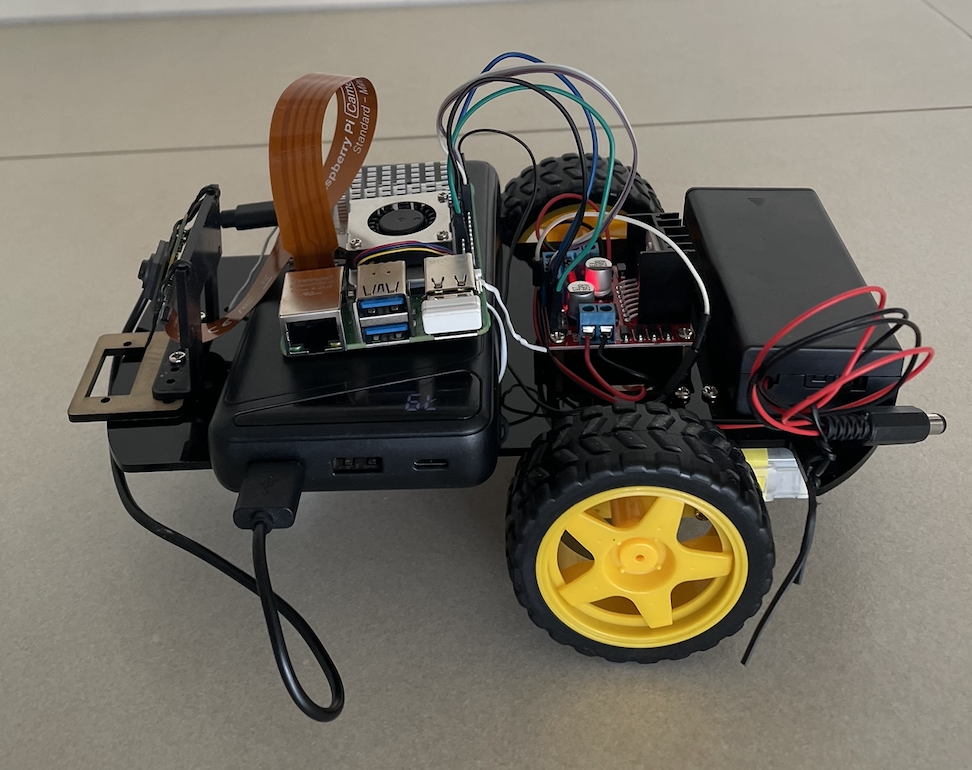

# RPi5-RC-Car
# Raspberry Pi Powered Remote Control Car
I built a 2WD remote control car, which is controlled with a Raspberry Pi 5 and a Bluetooth Keyboard. This project was for fun. The Raspberry Pi controls the car motors via a L298N motor driver, enabling forward, backward, left, and right movements. I used ChatGPT to produce Python code to program the Raspberry Pi. You can watch a short demo video of the car [here](media/car_demo.mp4). Below is a photo of the car. 



This project serves as a starting point for learning about Raspberry Pi, GPIO and motor-control. In future iterations of this repo, I want to explore basic autonomous systems and computer vision. I plan to do this with the following add-ons to this project,
- Using `systemd` to run the code on startup, so that the car can operate without needing to manually run the script or interact with a monitor. 
- Voice controlled operation, directing the car with voice commands. 
- Basic, rule-based navigation, using ultrasonic sensor and "if-then" rules to determine behaviour.
- Autonomous navigation, using Raspberry Pi AI camera and computer vision model.
- Object detection and tracking. I want this car to be able to drive around the house, find my dog and follow it. I will then call my creation DOGBOT. 

## Try It Yourself

Follow these steps to set up and run the remote-controlled car project:

### 1. Requirements
- **Hardware**:
  - Raspberry Pi 5 (This code may also be suited to previous Raspberry Pi models, however I cannot guarantee, as I have only done it on a RPi 5.)
  - Motor driver (I used a L298N)
  - 2WD Robot Chassis Kit, including two DC motors
  - Bluetooth keyboard and mouse (for programming and car control)
  - Power source for the motors (I used 2 x 3.7V 18650 Lithium Ion batteries)
  - Battery holder for 2 x 18650 batteries, with leads. 
  - Power source for the Raspberry Pi (I used a power bank which I already had, it’s a Cygnett one which is a few years old. A newer power bank would likely offer similar performance in a smaller package.)
  - F/F jumper wires, for connecting GPIO pins to motor driver control pins
  - M/F jumper wires, for connecting GPIO ground to motor driver ground
  - Monitor for RPi 5, and microHDMI to HDMI cord

- **Software**:
  - Python 3 installed on your Raspberry Pi 
  - Libraries: gpiozero, keyboard, lgpio, pigpio, RPi.GPIO. 
`requirements.txt` is included in the repository for easy installation of these packages. Note, I chose to pip install these in a virtual environment on my Raspberry Pi 5.

### **2. Wiring the Components**
I have drawn a basic wiring schematic which is available [here](Car%20Wiring%20Diagram.jpg).
The basic wiring instructions are as follows, 
- Connect the motors to the motor driver.
- Wire the motor driver to the Raspberry Pi GPIO pins as described in the code:
  - Left Motor: `IN1`, `IN2`, `ENA`
  - Right Motor: `IN3`, `IN4`, `ENB`
- Connect 18650 battery holder red and black leads to motor driver +12V and GND ports, respectively. Connect a Raspberry Pi GPIO GND pin to motor driver GND port as well.

Note, I programmed the Raspberry Pi while it was connected to an official Raspberry Pi power supply and plugged into a monitor. When ready to test, I powered off the Raspberry Pi, swapped the power supply to a power bank, and powered it back on while keeping it connected to the monitor. I ran the code and tested the controls by lifting the car off the ground to ensure it wouldn't move. Once I confirmed the controls were working, I disconnected the HDMI cable, leaving the car completely untethered, and drove it around using the Bluetooth keyboard.

### **3. Running the Code**
Follow these steps to clone the repository, install dependencies, and run the RC Car code.

#### Step 1: Clone the Repository
Clone the repository to your Raspberry Pi:
```bash
git clone https://github.com/izzy-pat/RPi5-RC-Car.git
cd RPi5-RC-Car
```
#### Step 2: Create a Virtual Environment
Setup a virtual environment to isolate dependencies:
```bash
python3 -m venv myenv
```
Activate the virtual environment
```bash
source myenv/bin/activate
```
#### Step 3: Install Dependencies
Install the required Python packages using `pip`:
```bash
pip install -r requirements.txt
```
#### Step 4: Run the Code
Run the `Car.py` script with elevated permissions:
```bash
sudo ./myenv/bin/python Car.py
```

## Control Instructions
You can control the car using your keyboard with the following controls:
- W: Move forward
- S: Move backward
- A: Turn left
- D: Turn right
- Space: Stop the car
- Ctrl+C: Exit the program

The code supports pressing forward/backward and left/right keys simultaneously for smooth and intuitive directional changes, similar to RC car or video game controls. For example, pressing `W + D` makes the car move forward and turn right.

### Customizing Speed and Turning
The speed variables, BASE_SPEED and TURN_SPEED, are used as scaling factors to set the duty cycle of the PWM wave, where their values (ranging from 0 to 1) directly control the proportion of time the motor receives power, thereby determining its speed.

The speed and turning behavior of the car can be adjusted by modifying the `BASE_SPEED` and `TURN_SPEED` variables in the code:
- `BASE_SPEED`: The default speed for moving forward or backward, ranging from `0` to `1`.
- `TURN_SPEED`: The reduced speed of one motor during turning, also ranging from `0` to `1`.

I have chosen the following default values for these variables, based off my experience driving the car. However, you could vary these and see what suits your application best. The ratio of BASE_SPEED to TURN_SPEED determines how tightly the car turns. 
- `BASE_SPEED = 0.8`
- `TURN_SPEED = 0.2`

# License
This project is licensed under the MIT License - see the LICENSE file for details.
